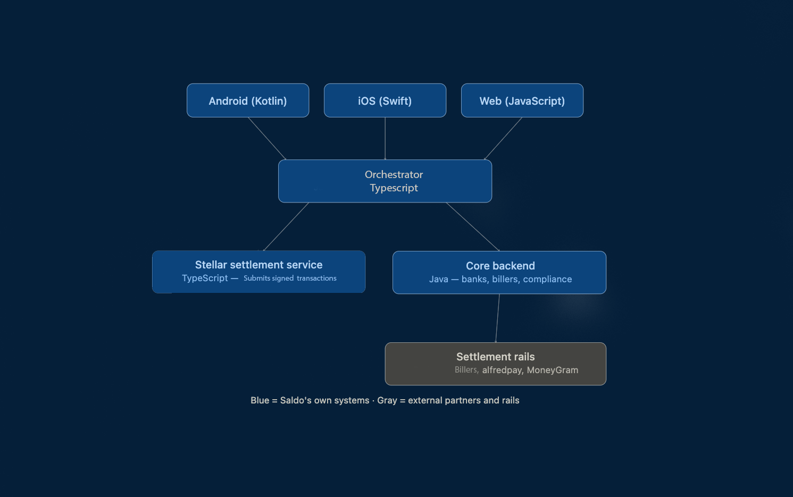
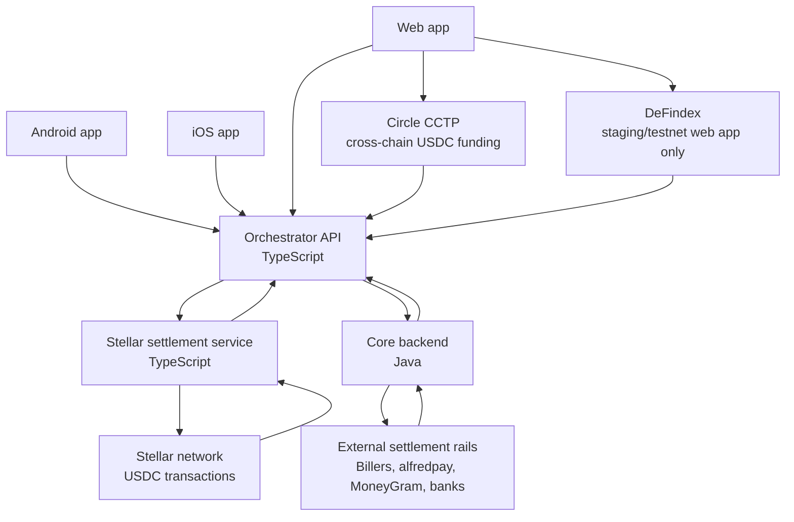

# Saldo Stellar Architecture

Saldo is integrating Stellar USDC into an existing U.S.-Mexico bill payment product. The system lets users fund a non-custodial USDC wallet, pay Mexican billers, settle into MXN through local rails, and reconcile each off-chain payment with its corresponding Stellar transaction.

This repository documents the target architecture.

The Mermaid diagram below is the current target architecture, including the Circle CCTP production web wallet receive flow and the DeFindex staging/testnet web app integration.

## System Overview

Saldo uses a service-oriented architecture with three client applications, a TypeScript orchestration layer, a Stellar settlement service, and a Java core backend that connects to billers, banks, compliance providers, and local settlement rails.

Blue boxes in the product diagram represent Saldo-owned systems. Gray boxes represent external partners and payment rails.

## Repository Map

Saldo is split across public architecture/demo repositories and private production repositories:

| Repository | Visibility | Role |
| --- | --- | --- |
| [saldo_architecture](https://github.com/unfodl/saldo_architecture) | Public | Architecture diagrams, roadmap, integration notes, and technical documentation. |
| [saldo_web](https://github.com/unfodl/saldo_web) | Public | Web app demo and agent/operations interface prototype. |
| [saldo](https://github.com/unfodl/saldo) | Private | Java core backend for billers, banks, compliance, and settlement rail integrations. |
| [saldowallet_android](https://github.com/unfodl/saldowallet_android) | Private | Native Android non-custodial Saldo wallet in Kotlin. |
| [saldo-stellar](https://github.com/unfodl/saldo-stellar) | Private | TypeScript Stellar wallet and settlement service. |
| [saldo-stellar-ios](https://github.com/unfodl/saldo-stellar-ios) | Private | iOS wallet application and Stellar client implementation. |

## Core Components

### Client Applications

Saldo exposes the same payment and wallet capabilities across three application surfaces:

- Android mobile app.
- iOS mobile app.
- Web application for internal operations and agent-facing workflows.

The mobile apps use an embedded non-custodial MPC wallet provider for consumer wallet provisioning. The provider is implementation infrastructure; the Stellar-specific work is account creation, USDC trustline management, SEP-30-style account recovery testing, transaction tracking, and reconciliation.

The agent web interface can use Stellar Wallets Kit for wallet connection and signing flows where an agent or operator needs to connect a Stellar-compatible wallet from a browser. The web interface can also support inbound USDC funding from other chains through Circle CCTP. This CCTP receive flow is scoped to the web wallet experience and is part of the production integration plan.

The web app will also include a staging/testnet-only DeFindex integration for testing vault deposit, withdraw, and balance flows with testnet assets. DeFindex is not part of the production launch scope and is not exposed in the consumer mobile wallet flow.

### Orchestrator API

The Orchestrator is the main product API used by all client applications. It owns user-facing workflow state and acts as the transaction ledger for cross-system activity.

Its responsibilities are:

- Create and track wallet records for users.
- Coordinate wallet operations, bill payments, SPEI transfers, and cash-in/cash-out requests.
- Track wallet recovery state and testnet recovery events.
- Maintain the internal ledger state for each transaction.
- Store references to Stellar transaction hashes and partner transaction IDs.
- Track inbound CCTP deposits initiated from the web interface.
- Track DeFindex staging/testnet vault activity separately from production ledger activity.
- Normalize statuses from Stellar, billers, alfredpay, MoneyGram, and bank/payment providers.
- Expose transaction history and payment status to the client applications.

The Orchestrator does not directly talk to every external payment rail. Instead, it coordinates specialized services and records the state transitions needed for auditability and support.

### Stellar Settlement Service

The Stellar settlement service is a TypeScript service responsible for Stellar-specific transaction handling.

Its responsibilities are:

- Create Stellar accounts and USDC trustlines when needed.
- Build Stellar transactions for wallet and payment flows.
- Submit signed transactions to Stellar.
- Monitor submitted transactions until finality.
- Return transaction hashes, ledger status, and failure details to the Orchestrator.
- Provide a narrow abstraction over Stellar RPC/Horizon so the rest of the system does not need to know Stellar protocol details.

This service is intentionally separate from the Orchestrator so Stellar submission, monitoring, retries, and protocol updates can evolve independently from product workflow logic.

### Core Backend

The Core Backend is a Java service that connects Saldo's product workflows to financial and operational rails.

Its responsibilities are:

- Connect to Mexican billers and service providers.
- Connect to bank/payment APIs for MXN movement.
- Integrate with alfredpay for USDC-to-MXN settlement and SPEI flows.
- Integrate with MoneyGram or a provider-ready cash rail adapter for cash-in/cash-out.
- Apply compliance checks and transaction controls before settlement.
- Return partner transaction IDs, settlement statuses, and failure reasons to the Orchestrator.

The Core Backend is the system of integration for billers, banks, compliance providers, and local settlement partners. It is kept separate from the Stellar settlement service because those integrations follow different operational, compliance, and reliability requirements.

## Transaction Model

Every user-facing movement is represented as an internal transaction in the Orchestrator ledger. A single transaction may have multiple external references:

- Saldo transaction ID.
- User wallet address.
- Stellar transaction hash.
- alfredpay transaction ID.
- SPEI reference.
- Biller payment reference.
- MoneyGram or cash rail reference.
- Compliance review status.

This gives support, reconciliation, and compliance teams one canonical place to inspect transaction state while still preserving links to each underlying rail.

## Example Flow: USDC-Funded Bill Payment

1. A user selects a Mexican biller and chooses to pay from USDC balance.
2. The client app sends the request to the Orchestrator.
3. The Orchestrator creates an internal payment record and requests the required Stellar operation from the Stellar settlement service.
4. The Stellar settlement service submits the USDC transaction and returns the Stellar transaction hash and status.
5. The Orchestrator asks the Java Core Backend to settle the biller payment through alfredpay, bank rails, or the relevant biller integration.
6. The Core Backend returns partner references and settlement status.
7. The Orchestrator updates the ledger and exposes the final status in the app and operations dashboard.

## Integration Building Blocks

- alfredpay for USDC-to-MXN settlement, SPEI transfers, and local banking rails.
- MoneyGram for cash-in/cash-out through physical locations, subject to partner approval.
- Stellar Wallets Kit for browser-based wallet connection and signing in the agent web interface.
- Circle CCTP for web-only inbound USDC funding from other chains into Stellar USDC.
- DeFindex for web app staging/testnet vault integration only; it is not included in production launch scope.

The consumer mobile app may use an embedded MPC wallet provider, but that provider is not the primary SCF Integration Track building block.

## Supporting Stellar Standards

- SEP-30 account recovery is an early testnet workstream for mobile wallet recovery and new-device recovery testing. It is not treated as a separate Integration Track building block.

## Roadmap

| Phase | Scope | Environment |
| --- | --- | --- |
| Wallet and ledger foundation | Embedded MPC mobile wallet, Stellar accounts, USDC trustlines, SEP-30 recovery testing, transaction history, and internal ledger references. | Testnet, then production |
| Bill pay and settlement | USDC-funded bill pay, alfredpay SPEI/MXN settlement, MoneyGram/provider-ready cash rail adapter, and ops reconciliation. | Testnet, then production |
| Web wallet integrations | Stellar Wallets Kit for browser signing and Circle CCTP for inbound USDC from other chains. | Production web app |
| DeFindex exploration | Vault deposit, withdraw, balance, and reconciliation testing from the web app. | Staging/testnet only |

## Repository Contents

- `docs/architecture.md`: one-page technical architecture.
- `docs/components.md`: component responsibilities and system boundaries.
- `docs/flows.md`: main transaction flows.
- `docs/integrations.md`: Stellar and partner integration scope.
- `docs/repositories.md`: repository map and ownership boundaries.
- `docs/roadmap.md`: phased implementation roadmap.
- `diagrams/system-architecture.mmd`: Mermaid source for the system diagram.
- `diagrams/architecture.png`: original visual architecture concept.
