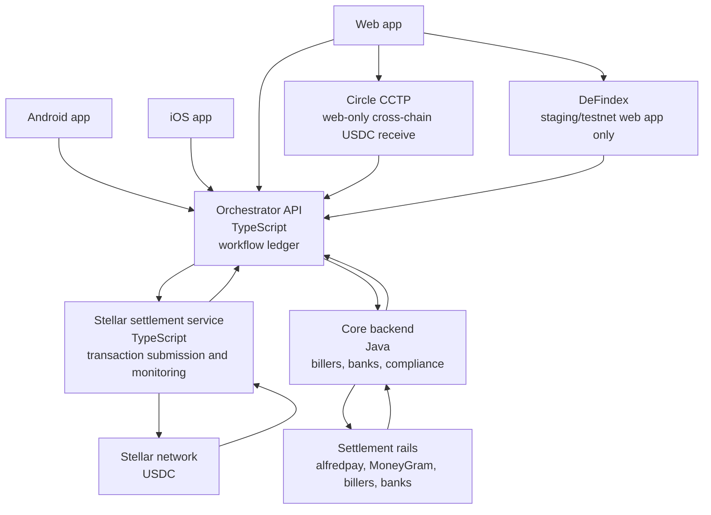

# Technical Architecture

Saldo's Stellar integration is built around a ledger-first orchestration model. Three client applications, Android, iOS, and Web, call a TypeScript Orchestrator API. The Orchestrator owns user-facing workflow state, records every transaction, and coordinates the services that interact with Stellar and external settlement rails.

The architecture separates product orchestration from rail-specific execution. Stellar activity is handled by a dedicated TypeScript Stellar settlement service. Biller, bank, alfredpay, MoneyGram, and compliance integrations are handled by the Java Core Backend.

## Client Layer

The mobile apps expose the consumer wallet and bill payment experience. Users can create a non-custodial wallet, view USDC balance, receive funds, send USDC, and pay supported Mexican billers from wallet balance. The mobile wallet is provisioned through an embedded MPC wallet provider.

The web application supports operations and agent-facing workflows. For agent or operator signing in the browser, the web app can use Stellar Wallets Kit to connect Stellar-compatible wallets and route signatures through a standard Stellar wallet connection layer.

The web application also supports a web-only cross-chain receive flow through Circle CCTP. This allows a connected web wallet to receive USDC from supported external chains into Stellar USDC. This flow is part of the production web app plan and does not change the embedded MPC wallet model used in the consumer mobile apps.

The web application will also include a DeFindex integration in staging/testnet only. This lets Saldo test vault deposit, withdraw, balance, and reconciliation flows without adding DeFindex to the production launch scope.

## Orchestrator API

The Orchestrator is the primary API for all apps. It acts as Saldo's transaction ledger and workflow coordinator. It stores the canonical state for wallet creation, bill payments, SPEI transfers, cash-in/cash-out requests, partner references, settlement status, and reconciliation data.

The Orchestrator records both on-chain and off-chain references. A single Saldo transaction can include a Stellar transaction hash, CCTP transfer reference, alfredpay reference, SPEI reference, biller payment ID, MoneyGram reference, and compliance status. DeFindex staging/testnet vault activity is tracked separately from production ledger activity.

## Stellar Settlement Service

The Stellar settlement service isolates Stellar protocol work from the rest of the product. It creates Stellar accounts and USDC trustlines, builds and submits transactions, monitors transaction status, and returns ledger results to the Orchestrator.

This service is intentionally narrow. It does not decide product workflow outcomes; it submits and monitors Stellar operations and gives the Orchestrator the data needed for reconciliation.

## Java Core Backend

The Java Core Backend handles external financial integrations. It connects to billers, banks, compliance systems, alfredpay for USDC-to-MXN/SPEI flows, and MoneyGram or another approved cash rail provider for cash-in/cash-out.

The Core Backend returns partner transaction IDs, settlement status, compliance outcomes, and failure reasons to the Orchestrator. This keeps operational integrations separate from Stellar-specific transaction infrastructure.

## Reconciliation Model

Every money movement is anchored by a Saldo transaction ID in the Orchestrator. On-chain movement is linked by Stellar transaction hash. Off-chain movement is linked by partner references. This model gives support, compliance, and operations teams one place to inspect transaction state while preserving direct links to the underlying rails.

The target outcome is a production system where each USDC-funded bill payment can be traced from client request, to Stellar transaction, to MXN/SPEI or biller settlement, to final user-visible status.
