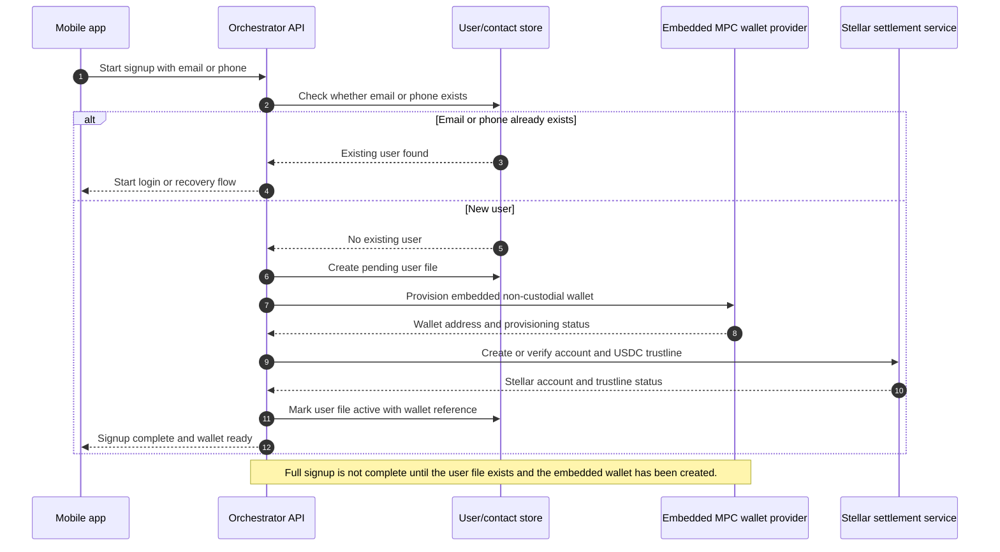
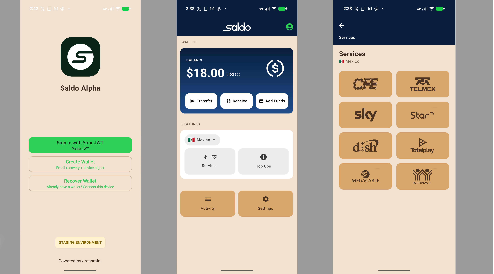

# Transaction Flows

## Signup And Wallet Provisioning

The mobile app never treats signup as complete by itself. Signup completes only after the Orchestrator has created the user file, provisioned the embedded wallet, and stored the wallet reference.

## Wallet Provisioning

1. User starts onboarding in the mobile app.
2. App calls the Orchestrator.
3. Orchestrator creates the user wallet record.
4. Embedded MPC wallet provider provisions the non-custodial wallet.
5. Stellar settlement service creates or verifies the Stellar account and USDC trustline.
6. Orchestrator stores the wallet address and setup status.
7. App shows wallet as ready.

## Testnet Wallet Recovery

1. User starts recovery from a new device in the mobile app.
2. App calls the Orchestrator to begin the recovery workflow.
3. Orchestrator creates a recovery event linked to the user's wallet record.
4. The recovery flow validates SEP-30-style recovery assumptions on testnet.
5. Stellar settlement service verifies recovered wallet access and testnet account state.
6. Orchestrator stores the recovery outcome, device context, and testnet validation status.
7. App shows the recovered wallet as ready only after recovery validation succeeds.

This flow is implemented and tested early on testnet before production wallet rollout.

## USDC-Funded Bill Payment

The example mobile flow shows the user moving from login/recovery into the wallet home screen, then into the Mexico services screen where supported bill pay companies are listed.

1. User selects a biller and confirms payment from USDC balance.
2. App sends payment request to the Orchestrator.
3. Orchestrator creates a Saldo payment record.
4. Stellar settlement service submits the required Stellar transaction and returns the transaction hash.
5. Orchestrator calls the Java Core Backend to settle the bill payment.
6. Core Backend routes settlement through biller, bank, or alfredpay rails.
7. Core Backend returns partner references and final or pending settlement status.
8. Orchestrator updates the ledger and app-visible transaction history.

## SPEI / MXN Settlement With alfredpay

1. User or workflow requests MXN settlement or SPEI transfer.
2. Orchestrator records the request and validates transaction state.
3. Stellar settlement service confirms the related USDC movement.
4. Java Core Backend calls alfredpay for USDC-to-MXN settlement or SPEI transfer.
5. alfredpay returns quote, transaction reference, and status.
6. Core Backend reports status to the Orchestrator.
7. Orchestrator stores the alfredpay reference and updates the transaction ledger.

## Cash-In / Cash-Out

1. User starts a MoneyGram cash-in or cash-out flow.
2. App calls the Orchestrator.
3. Orchestrator creates the cash transaction record.
4. Wallet authenticates with the MoneyGram Stellar anchor using SEP-10.
5. Java Core Backend starts the SEP-24 interactive deposit or withdrawal flow.
6. User completes the MoneyGram webview/browser flow.
7. Stellar settlement service handles the required USDC movement and memo handling.
8. Core Backend polls transaction status and returns the MoneyGram reference and status.
9. Orchestrator reconciles Stellar and cash rail state.

## Agent Web Signing

1. Agent opens the web interface.
2. Web app uses Stellar Wallets Kit to connect a Stellar-compatible wallet.
3. Agent reviews an operation requiring signature.
4. Web app requests signature through Stellar Wallets Kit.
5. Signed payload is submitted to the Orchestrator.
6. Orchestrator routes Stellar operations to the Stellar settlement service and operational updates to the Java Core Backend.

## Web Wallet Cross-Chain USDC Receive With Circle CCTP

1. User opens the web wallet interface.
2. Web app connects a Stellar-compatible wallet through Stellar Wallets Kit.
3. User selects an inbound USDC transfer from a supported external chain.
4. Web app starts the Circle CCTP flow and captures the transfer reference.
5. Orchestrator creates an internal deposit record for the inbound web wallet funding flow.
6. Stellar settlement service monitors the resulting Stellar USDC receipt.
7. Orchestrator links the CCTP reference, Stellar transaction hash, wallet address, and final deposit status.

This flow is limited to the web wallet interface. Consumer mobile wallets continue to use the embedded MPC wallet provider and do not expose CCTP receive in the initial architecture.

## Web App DeFindex Vault Testing

1. User opens the staging web app.
2. Web app connects a Stellar-compatible testnet wallet through Stellar Wallets Kit.
3. User selects a testnet DeFindex vault action such as deposit, withdraw, or balance lookup.
4. Web app requests the required transaction or vault data through the DeFindex integration.
5. User signs the testnet operation from the browser wallet.
6. Orchestrator records the staging/testnet vault reference and related Stellar testnet transaction hash.
7. Staging dashboard displays the testnet vault activity for product and reconciliation testing.

This flow is staging/testnet only. It is not part of the production launch scope and is not exposed in the consumer mobile apps.
